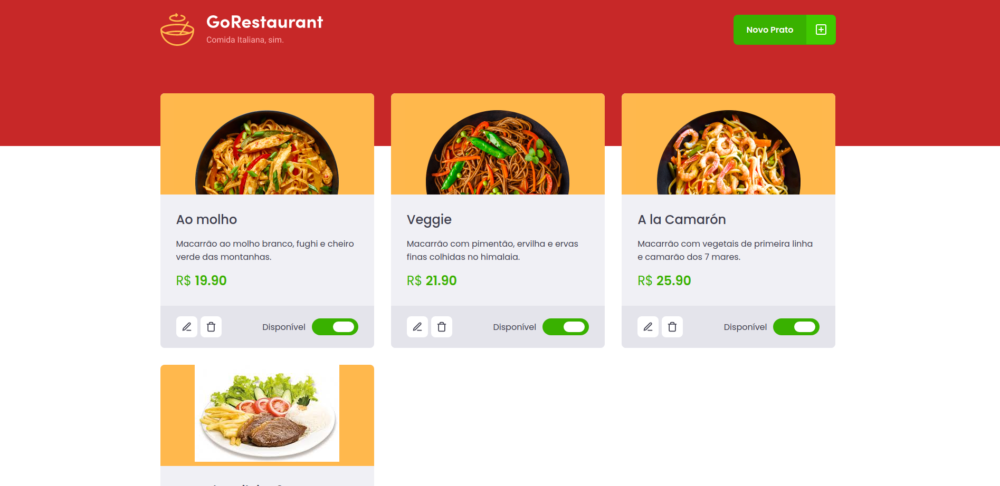

<h2>Resultado:</h2>

<h1 align="center">
  GORestaurant
  <br /> <br />
  
  <br /> <br />
  
  <br /> <br />
  
  <br /> <br />
  
  <br /> <br />
  <h2>Testes</h2>
  
</h1>

# `Indice`

<a href="#ReactJS">1. ReactJS</a> <br />
<a href="#Tecnologias-utilizadas">2. Tecnologias utilizadas</a> <br />
<a href="#Como-baixar-o-projeto">3. Como baixar o projeto</a>

## Sobre o desafio

Essa será uma aplicação que irá se conectar a uma fake API, e exibir os pratos de comida criados e permitir a criação, remoção e atualização desses pratos.

---

## Tecnologias utilizadas

O projeto foi desenvolvido utilizando as seguintes tecnologias:

- ReactJS
- Axios
- TypeScript
- Styled-Components
- Polished
- ReactIcons

---
## Como baixar o projeto


```bash

  # Clonar o repositório
  $ git clone https://github.com/DevTeles/GoRestaurant-Web.git

  # Entrar no diretório
  $ cd GoRestaurant-Web

  # Instalar as dependências
  $ yarn install

  # Rodando a API Faker
  $ yarn json-server server.json -p 3333

  # Iniciar o projeto
  $ yarn start
```

<br /><br />
Desenvolvido por **Rafael Teles Vital**
